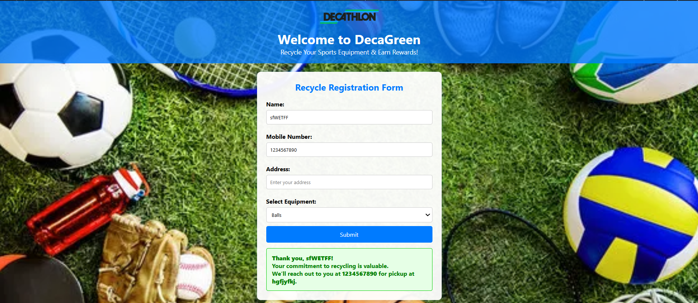

# ♻️ DecaGreen – Internship Project (Bolt IoT)

This is a sustainable recycling project developed during my 8-week remote internship as an **AI Developer Intern at Inventrom Pvt. Ltd. (Bolt IoT)**.  
The project promotes responsible disposal and recycling of used sports equipment by encouraging user participation through a web-based interface in collaboration with Decathlon.

---

## 📝 Internship Details

- **Intern Name:** Sakshi Mane  
- **Company:** Inventrom Pvt. Ltd. – Bolt IoT  
- **Role:** AI Developer Intern  
- **Duration:** 8 Weeks (Remote)  
- **Project Name:** DecaGreen  
- **Completion Date:** 29th Jan 2024

---

## 🎯 Project Objective

The **DecaGreen** initiative is designed to reduce sports waste by allowing customers to return used equipment to Decathlon. This helps in resource recycling, customer engagement, and environmental awareness.

---

## 💰 Customer Rewards System

To encourage maximum participation, customers who return old sports equipment are rewarded with:

- 🎁 **Discounts** on future Decathlon purchases  
- 🏅 **Loyalty points** that can be redeemed online or in-store  

These rewards incentivize sustainable behavior while helping Decathlon strengthen customer relationships.

---

## 🛠️ Tech Stack

- HTML5  
- CSS3  
- JavaScript (Vanilla)  
- Responsive Web Design

---

## 🌟 Features

- 📝 Registration form with validation  
- 📞 Phone number format check (10-digit, starts with 6–9)  
- 📋 Categorized sports equipment dropdown  
- ✅ Real-time form confirmation message  
- 🌍 Attractive background image and logo  
- 📱 Fully responsive on mobile, tablet, and desktop  
- 🧪 Clean code with reusable structure

---

## 📷 Preview

  

---

## 🧪 How to Run Locally

1. Clone or download this repository  
2. Make sure all files (`index.html`, `style.css`, `script.js`, and images) are in the same folder  
3. Open `index.html` in any modern browser

---

## 🚀 Future Enhancements

- 🔐 Store form data in Google Sheets or Firebase  
- 📍 Google Maps API for nearest store locator  
- 📧 Email confirmation via EmailJS  
- 🌓 Dark mode toggle & animations (AOS, ScrollReveal)

---

© 2024 Sakshi Mane | Internship Project – Inventrom (Bolt IoT)
